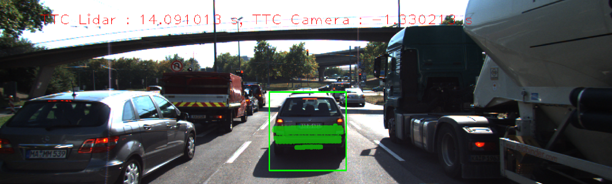
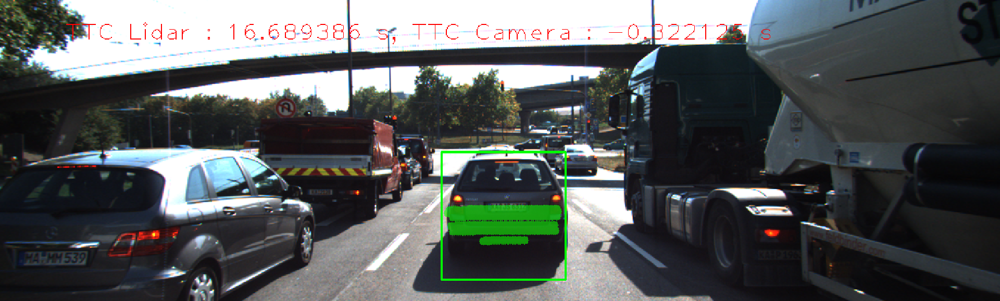

# Report for Project SFND 3D Object Tracking
## FP.1 Match 3D Objects
The function `matchBoundingBoxes` in lines 235-295 in `camFusion_Student.cpp`.
## FP.2 Compute Lidar-based TTC
The function `computeTTCLidar` in lines 198-217 in `camFusion_Student.cpp`.
## FP.3  Associate Keypoint Correspondences with Bounding Boxes
The function `clusterKptMatchesWithROI` in lines 134-143 in `camFusion_Student.cpp`.
## FP.4 Compute Camera-based TTC
The function `computeTTTCamera` in lines 146-195 in `camFusion_Student.cpp`.
## FP.5 Performance Evaluation 1
The TTC estimate of the Lidar sensor is quite good and stable.
In order to avoid severe estimation errors,
the median point has been taken to estimate the TTC.
Some examples can be found in the following.

## FP.6 Performance Evaluation 2
I implement all the detectors and save all information in the [res.csv](./res/res.csv) file.
Some combinations, i.e., AKAZE/SIFT, AKAZE/AKAZE, SHITOMASI/SIFT and FAST/BRIEF, gives good TTC estimations.

Sometimes, the result of the TTC estimate of the camera sensor is negative.
I think because the keypoints in the ROI do not belong to the preceding vehicle.